<!--
  fix_old_img — Deep Learning Old Photo Restoration, Scratch Repair & Colorization
  中文版;英文版请查看 README_EN.md
-->
<div align="center">

# 基于深度学习的旧照片恢复、划痕修复与老照片上色系统

**Deep Learning Based Old Photo Restoration, Scratch Repair & Colorization**

[](https://www.python.org/)
[](https://pytorch.org/)
[](https://gradio.app/)
[](https://fastapi.tiangolo.com/)
[](LICENSE)

**中文** | [English](./README_EN.md)

<p align="center">
  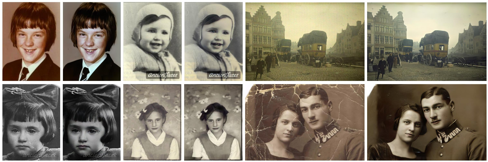
</p>

本系统用 Python 3.11 与 PyTorch（CUDA 12.8）构建了一套面向真实老照片的 Web 端图像修复系统：支持整体质量修复、划痕检测与修复、面部增强，以及黑白老照片自动上色。Web 层使用 Gradio 6 + FastAPI + Uvicorn，数据层使用 SQLite（WAL），并附带完整的管理后台（任务记录、照片档案、用户管理）。

</div>

---

## 📑 目录

- [1. 项目解决的问题](#1-项目解决的问题)
- [2. 主要功能](#2-主要功能)
- [3. 使用的技术](#3-使用的技术)
- [4. 安装方法](#4-安装方法)
- [5. 使用方法](#5-使用方法)
- [6. 输入输出示例](#6-输入输出示例)
- [7. 项目结构](#7-项目结构)
- [8. 常见问题](#8-常见问题)
- [9. 第三方组件与许可](#9-第三方组件与许可)

---

## 1. 项目解决的问题

老照片在保存和扫描过程中普遍存在以下问题：

- **整体退化**：褪色、模糊、噪点、对比度下降；
- **物理损伤**：折痕、划痕、污渍；
- **黑白化**：早期照片只有灰度信息，缺少自然色彩；
- **面部细节丢失**：人像区域细节严重退化，常规修复难以恢复；
- **修复过程不可见**：批量处理缺少任务记录、结果归档与质量指标。

本系统针对上述问题提供一条完整的处理链路：**整体质量修复 → 划痕检测/修复 → 人脸检测与增强 → 回卷合成**，并在同一平台内集成了 **DDColor 老照片上色** 能力，同时提供用户登录、注册、任务历史、照片档案和用户管理等配套功能。

## 2. 主要功能

### 2.1 图像处理模块（四个标签页）

| 模块 | 说明 | 输出 |
| --- | --- | --- |
| 不带划痕的旧照片复原 | 整体质量提升 + 人脸检测与面部增强 | 修复后的彩色照片 + PSNR/SSIM/MAE 指标 |
| 带划痕的旧照片复原 | 自动划痕检测 → 划痕修复 → 质量提升 → 面部增强 | 修复后的彩色照片 + 指标 |
| 划痕检测 | 独立输出划痕位置 | 黑白二值 mask（白色为划痕） |
| 老照片上色 | DDColor 对黑白/灰度照片自动上色 | 彩色照片 |

### 2.2 管理面板（仅管理员可见）

- **任务管理**：处理历史记录、统计概览（任务数/用户数/各类型次数/平均指标）、清空记录；
- **照片档案**：按处理记录浏览原始图片与修复结果；
- **用户管理**：添加、修改（密码/角色）、删除用户。

### 2.3 平台能力

- 用户登录（pbkdf2 哈希、常量时间比对）与公开注册（IP/全局/用户名三重限流）；
- 健康检查接口 `GET /health`（存活）与 `GET /health/ready`（数据库就绪，异常时返回 503）；
- 启动时权重完整性自检（SHA-256 清单，缺失或篡改拒绝启动）；
- 请求级目录隔离 + 结果 TTL 自动回收；
- SQLite 存储（用户/历史），首次启动自动从旧版 users.yaml / JSONL 迁移；
- 深色主题界面，管理员/普通用户界面自动区分。

## 3. 使用的技术

| 类别 | 技术 |
| --- | --- |
| 语言/环境 | Python 3.11（conda 环境 `fixoldimg-gpu`） |
| Web 框架 | Gradio 6.22 + FastAPI 0.141 + Uvicorn 0.52 |
| 深度学习 | PyTorch 2.7.1+cu128（原生支持 RTX 50 系 sm_120） |
| 视觉/科学计算 | OpenCV 5.0、scikit-image 0.26、scipy 1.17、numpy 2.4、Pillow 12.3 |
| 人脸/上色 | dlib 20.0.1（conda-forge）、timm 0.9.2、DDColor |
| 存储 | SQLite（WAL 模式） |
| 模型 | Bringing Old Photos Back to Life + DDColor，共 29 个权重文件 |

### 3.1 整体质量修复、划痕检测与面部增强技术

本系统的修复链路（整体质量修复 / 划痕检测与修复 / 面部增强）采用以下技术方案：

**整体质量修复（Global Restoration）**

> 采用三元域翻译网络（triplet domain translation network），同时处理旧照片的结构化退化与非结构化退化：

- 分别训练域 A（退化旧照）与域 B（高质量新照）的 **VAE**（变分自编码器）模型，二者共享潜空间结构；
- 训练域间的 **mapping network（映射网络）**，将退化域隐变量翻译到高质量域，从而实现整体质量提升；
- 映射网络支持多种训练变体：`mapping_quality`（无划痕场景）、`mapping_scratch`（带划痕场景）、`mapping_Patch_Attention`（使用 Multi-Scale Patch Attention，用于高分辨率输入的划痕修复）；
- 训练采用 `pix2pixHD` 风格的双判别器 GAN 架构，通过 `--l2_feat / --use_l1_feat / --NL_res`（非局部残差）等选项控制损失与结构。

<p align="center">
  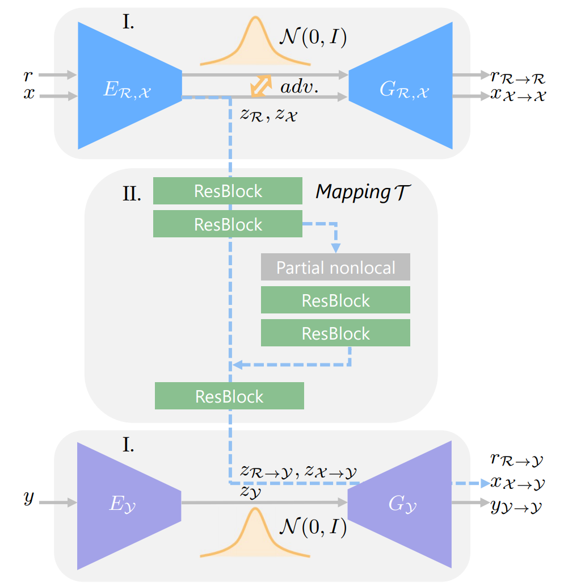
</p>

<p align="center">
  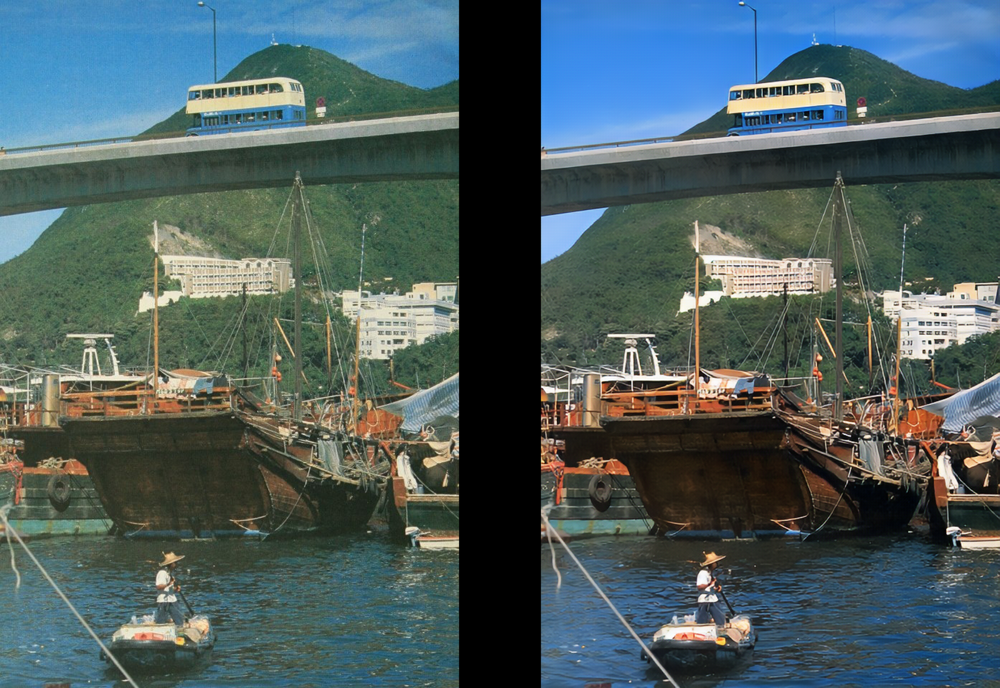
</p>

**划痕检测（Scratch Detection）**

> 划痕检测模型使用标注数据训练，输出黑白二值 mask（白色为划痕）。划痕修复链路对高分辨率输入使用 Multi-Scale Patch Attention 的非局部映射，可将带碎裂痕迹的老照片恢复为干净画面。

<p align="center">
  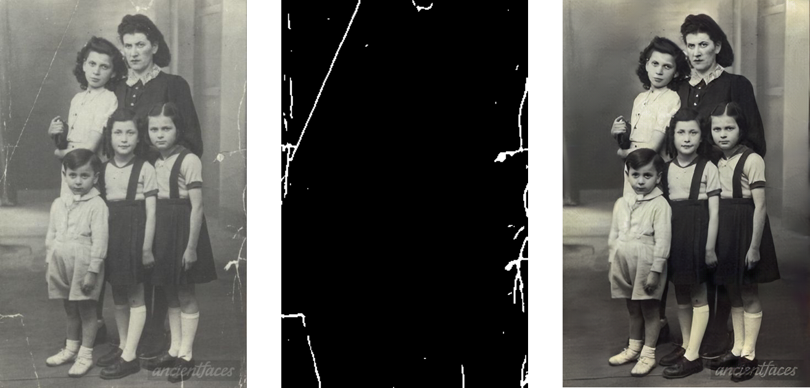
</p>

<p align="center">
  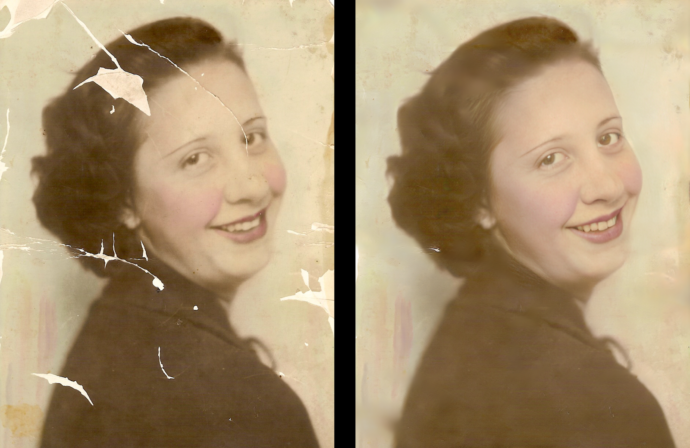
</p>

**人脸检测与面部增强（Face Detection & Enhancement）**

> 采用**渐进式生成器（progressive generator）**细化旧照片中的人脸区域：

- 人脸检测使用 dlib 的 `shape_predictor_68_face_landmarks.dat`（68 点人脸关键点检测器）；
- 检测到的人脸逐一裁剪、对齐后送入面部增强模型，增强完成后按原始几何关系**回卷（warp back）**合成回原图；
- 面部增强模型带同步批归一化（Synchronized-BatchNorm-PyTorch）与渐进式编码器结构，通过实例归一化参数调制逐级细化人脸。

<p align="center">
  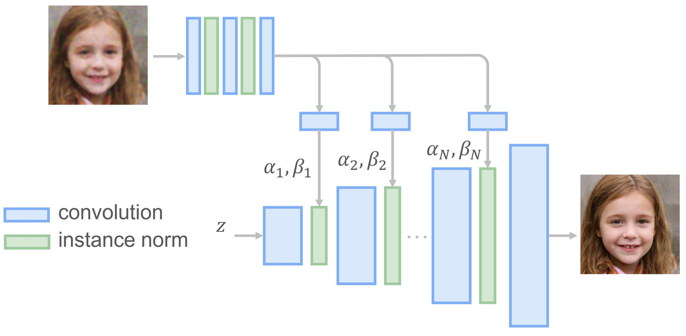
</p>

<p align="center">
  
</p>

> 注：该模型用 256×256 预训练，任意分辨率下效果可能非最优（本系统支持长边 ≤4096px 的输入）。

### 3.2 黑白照片上色技术

本系统的黑白照片自动上色模块采用以下技术方案：

> 使用**多尺度视觉特征**去优化**可学习的颜色 token（即颜色查询 color queries）**，在自动图像上色任务上达到 SOTA 水平：

- **双解码器结构（Dual Decoders）**：一个解码器做**颜色解码**（基于可学习颜色 token 与多尺度特征交互），一个解码器做**图像重建**（恢复空间细节），二者共同实现照片级真实的多彩着色；
- **骨干网络**：基于 ConvNeXt（`ConvNeXt-Large`，22k 预训练），编码器提取多尺度视觉特征；颜色 token 与特征通过类似 Transformer 的交叉注意力（Mask2Former / DETR 风格）进行交互；
- **颜色查询（color queries）**：一组可学习的颜色 embedding，被视为"颜色字典"，通过多尺度特征的查询得到目标颜色分布；
- 训练流程基于 **BasicSR** 工具箱（同步最小依赖为 `basicsr/` 子集），支持 `ddcolor_paper / ddcolor_modelscope / ddcolor_artistic / ddcolor_paper_tiny` 四种预训练模型规格；
- 本系统默认使用 `damo/cv_ddcolor_image-colorization` 权重：`weights/ddcolor/pytorch_model.pt`，模型规格 `large`，输入尺寸 512×512（均可通过环境变量调整）。

<p align="center">
  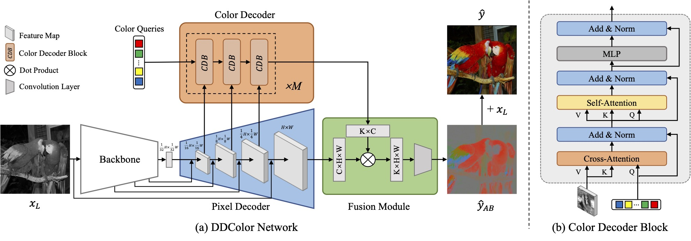
</p>

<p align="center">
  
</p>

<p align="center">
  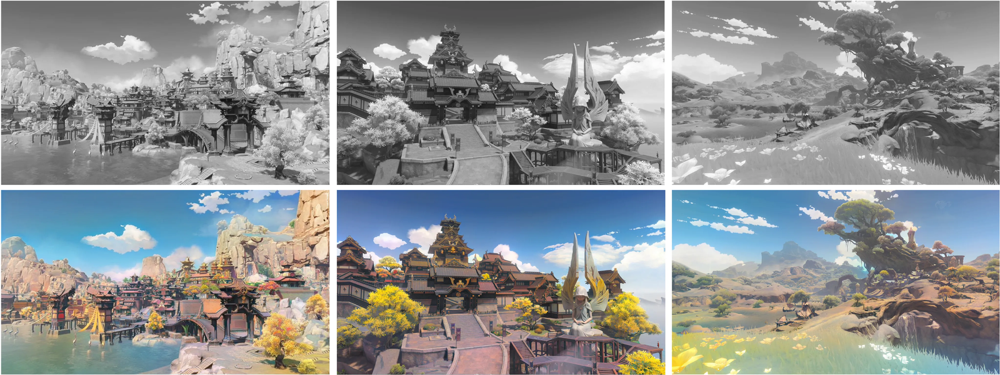
</p>

## 4. 安装方法

### 4.1 Windows（conda）

一键脚本方式：

```bat
scripts/setup_gpu.bat
```

或手动执行：

```bash
# 1. 创建环境
conda create -n fixoldimg-gpu python=3.11 -y
conda activate fixoldimg-gpu

# 2. 安装 PyTorch cu128（支持 RTX 50 系；国内网络可换
#    https://mirror.sjtu.edu.cn/pytorch-wheels/cu128）
pip install torch==2.7.1 torchvision==0.22.1 torchaudio==2.7.1 \
    --index-url https://download.pytorch.org/whl/cu128

# 3. 安装项目依赖（含 Gradio/FastAPI/OpenCV/DDColor 所需 timm 等）
pip install -r requirements.txt

# 4. 安装 dlib 预编译包（conda-forge，无需本机编译工具链）
conda install -n fixoldimg-gpu -c https://mirrors.tuna.tsinghua.edu.cn/anaconda/cloud/conda-forge \
    --override-channels -y dlib=20.0.1

# 5. 下载模型权重（BOB 修复链路 + DDColor 上色，约 1.5GB）
bash scripts/download_weights.sh

# 6. 若权重来源与仓库清单不同，重新生成并校验
python -m config.weights_check generate
python -m config.weights_check verify
```

> 注意：`config/users.yaml` 会被自动迁移到 SQLite（`admin_data/fixoldimg.db`）。若该文件缺失，服务启动后没有任何账号，请从备份恢复或使用管理端添加。

### 4.2 Docker（Linux + NVIDIA GPU）

```bash
docker build -t fixoldimg .
docker run --gpus all -p 9502:9502 fixoldimg
```

镜像会自动安装依赖、下载全部权重、生成默认管理员账号（`admin/admin123`）并重建权重清单。首次构建时 dlib 为源码编译，耗时约 5-10 分钟。

## 5. 使用方法

### 5.1 启动 Web 服务

```bash
conda activate fixoldimg-gpu
python main.py
```

浏览器访问 <http://127.0.0.1:9502>。

默认账号（**部署前必须修改**）：

| 用户名 | 密码 | 角色 |
| --- | --- | --- |
| admin | 安装/初始化时设置 | 管理员（仅管理面板） |
| user1 | 安装/初始化时设置 | 普通用户 |

> ⚠️ 本地开发环境为方便测试保留了演示口令（如 `admin/admin123`），
> 仅限开发使用；公开部署前请通过"管理面板 → 用户管理"轮换全部账号口令。

管理员登录后只显示"管理面板"；普通用户可使用四个图像处理标签页。

### 5.2 Web 操作流程

1. 登录（或点击"立即注册"创建账号）；
2. 选择对应功能标签页；
3. 上传图片（或点击标签页下方示例图自动填充）；
4. 点击"开始修复 / 提交复原 / 开始上色"；
5. 等待处理完成（GPU 环境单张约 1-60 秒，取决于模块与图片大小），查看结果与指标；
6. 管理员可在"管理面板"查看任务记录、照片档案并管理用户。

### 5.3 命令行批量处理

```bash
# 不带划痕的旧照片复原
python run.py --input_folder ./test_images/old --output_folder ./output

# 带划痕的旧照片复原
python run.py --input_folder ./test_images/old_w_scratch --output_folder ./output --with_scratch

# 高清人脸增强（可选）
python run.py --input_folder ./test_images/old --output_folder ./output --HR

# 显式指定 GPU / CPU
python run.py --input_folder ./test_images/old --output_folder ./output --GPU 0
```

输出目录包含 `final_output/`（最终结果）、各阶段中间产物与 `pipeline_report.json`（降级报告）。

### 5.4 常用环境变量

| 变量 | 默认值 | 说明 |
| --- | --- | --- |
| `FIXIMG_HOST` | `127.0.0.1` | 监听地址（局域网访问设为 `0.0.0.0`） |
| `FIXIMG_PORT` | `9502` | 监听端口 |
| `FIXIMG_RESULT_TTL` | `7200` | 推理产物保留秒数 |
| `FIXIMG_HISTORY_MAX` | `2000` | 历史记录上限 |
| `FIXIMG_ARCHIVE_TTL` | `604800` | 归档照片保留秒数 |
| `FIXIMG_DDCOLOR_MODEL` | `weights/ddcolor/pytorch_model.pt` | DDColor 权重路径 |
| `FIXIMG_COLORIZE_TTL` | `7200` | 上色结果保留秒数 |
| `FIXIMG_DDCOLOR_INPUT_SIZE` | `512` | DDColor 输入尺寸 |
| `FIXIMG_DDCOLOR_MODEL_SIZE` | `large` | DDColor 模型规格（large/medium） |
| `FIXIMG_REGISTER_MAX` / `_GLOBAL_MAX` / `_USERNAME_MAX` | `5/20/3` | 注册限流阈值 |
| `FIXIMG_REGISTER_WINDOW` | `600` | 注册限流窗口秒数 |
| `FIXIMG_TRUSTED_PROXIES` | 空 | 允许读取 `X-Forwarded-For` 的代理 IP，逗号分隔。默认不信任转发头，仅当对端地址在此白名单内时使用 |

`GET /health` 返回存活状态；`GET /health/ready` 额外检查 SQLite 连接，数据库异常时返回 HTTP 503。

## 6. 输入输出示例

以下示例均由当前系统实际生成（GPU 环境）。

### 6.1 不带划痕的旧照片复原

输入（退化旧照）→ 输出（修复结果）：

| 输入 | 输出 |
| --- | --- |
| 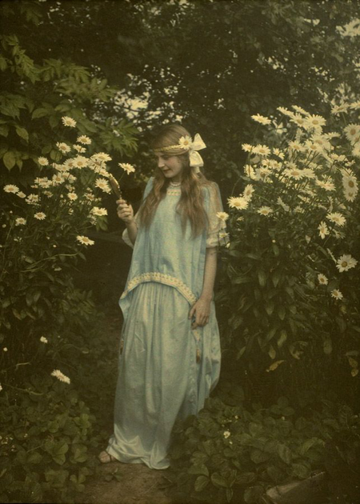 | 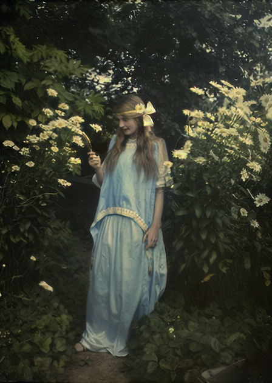 |

### 6.2 划痕检测

输入（带划痕照片）→ 输出（划痕 mask，白色为划痕）：

| 输入 | 输出 |
| --- | --- |
| 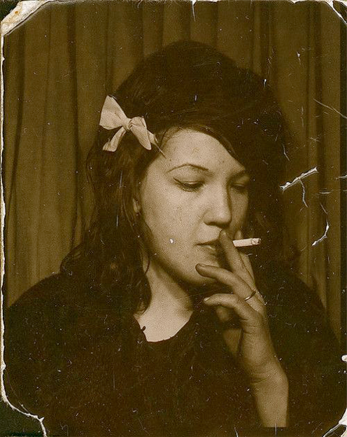 | 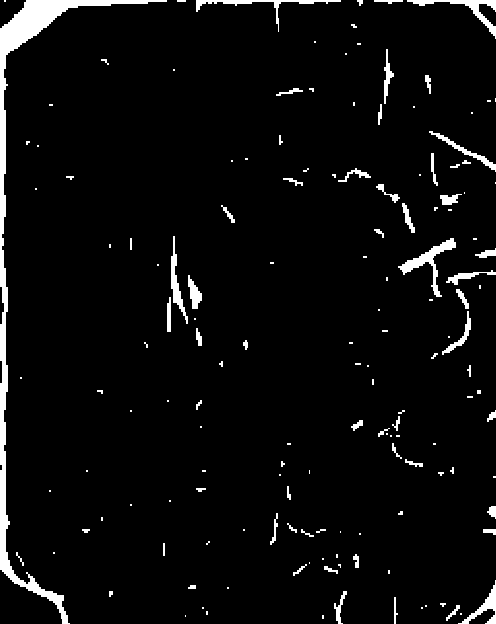 |

### 6.3 老照片上色

输入（黑白灰度照片）→ 输出（DDColor 上色结果）：

| 输入 | 输出 |
| --- | --- |
| 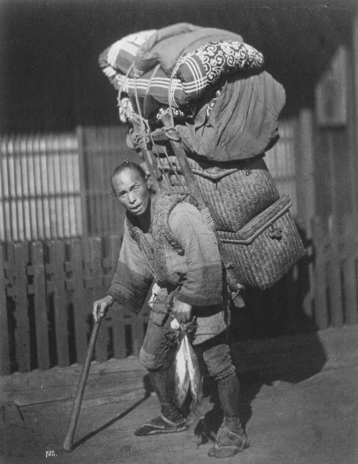 | 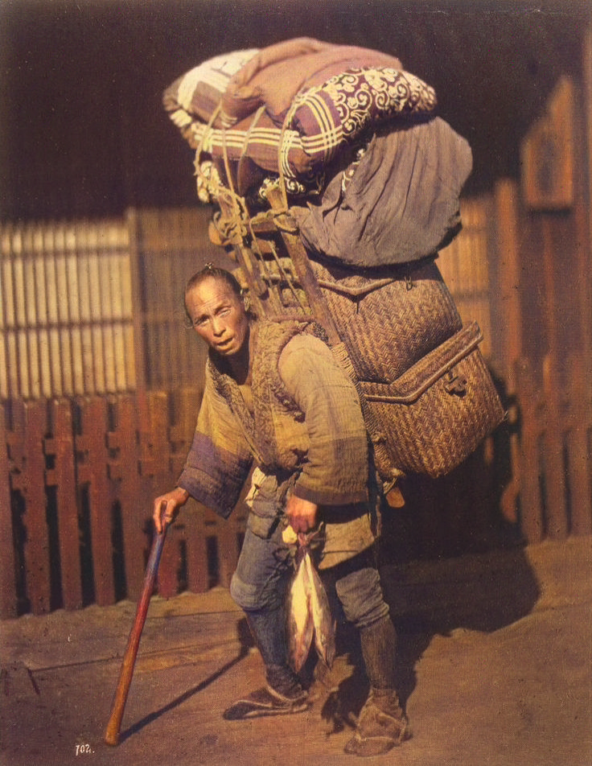 |

更多测试样例见 `examples/`（`old/`、`old_w_scratch/`、`color/`）与 `test_images/`。

## 7. 项目结构

```text
.
├── main.py                  # Web 服务入口（Gradio 6 + FastAPI + SQLite）
├── run.py                   # 四阶段推理流水线 CLI（整体修复/划痕检测/人脸增强/回卷）
├── app/                     # 应用层
│   ├── __init__.py          # 应用包
│   ├── db.py                # SQLite 数据层（用户/任务历史/归档/迁移）
│   ├── pipeline.py          # Web 推理流水线（请求隔离/指标计算/历史入库）
│   ├── colorizer.py         # DDColor 黑白照片上色模块
│   └── admin_panel.py       # 管理面板（任务管理/照片档案/用户管理）
├── config/                  # 配置与安全
│   ├── security.py          # PBKDF2 密码哈希 / 用户文件读写
│   ├── ratelimit.py         # 注册限流（IP/全局/用户名三重 + 可信代理）
│   ├── weights_check.py     # 权重 SHA-256 完整性校验
│   ├── users.example.yaml   # 用户凭据模板（不提交 users.yaml）
│   └── weights_manifest.json# 权重清单（记录每个文件的 SHA-256）
├── ddcolor/                 # DDColor 上色模型（Apache-2.0）
├── basicsr/                 # DDColor 所需 BasicSR 最小子集
├── Global/                  # 整体质量修复 / 划痕检测模型（BOB）
├── Face_Detection/          # dlib 人脸检测 / 68 点关键点 / 回卷
├── Face_Enhancement/        # 人脸增强模型（渐进式生成器）
├── examples/                # Web 示例图片（old / old_w_scratch / color）
├── test_images/             # CLI 测试图片
├── docs/
│   ├── examples/            # README 输入输出示例图
│   └── upstream/            # 算法展示图（架构/效果对比）
├── weights/ddcolor/         # DDColor 权重（不入库，需下载）
├── scripts/
│   ├── setup_gpu.bat        # Windows conda 一键安装脚本
│   ├── download_weights.sh  # 模型权重下载脚本
│   └── legacy/              # 旧版 conda 安装脚本（保留）
├── requirements.txt         # Python 依赖（固定版本）
├── requirements.lock        # pip freeze 锁定文件
├── Dockerfile               # NVIDIA CUDA 12.8 容器镜像
├── .dockerignore            # Docker 构建排除清单
├── .gitignore               # Git 忽略清单（权重/数据库/输出不入库）
├── LICENSE                  # 本项目 MIT 许可
├── LICENSE-Bringing-Old-Photos-Back-to-Life   # BOB 模型 MIT 许可
├── THIRD_PARTY_NOTICES.md   # 第三方组件与许可说明
├── README.md                # 项目文档（中文）
├── README_EN.md             # 项目文档（英文）
└── weights_manifest（由 config/weights_check.py 生成）
```

## 8. 常见问题

**Q1：启动提示"权重完整性校验失败"**
权重缺失或哈希不符。运行 `bash scripts/download_weights.sh` 补齐，然后执行 `python -m config.weights_check generate` 重新生成清单（本地权重与仓库清单不一致时同样处理）。

**Q2：CUDA 不可用 / 提示 sm_120 不兼容**
请确认安装的是 torch 2.7.1+cu128 及以上（RTX 50 系需要 cu128 构建）；老版本 cu121 不支持 Blackwell 架构。

**Q3：老照片上色首次很慢**
首次调用需要加载 DDColor 权重（约 3 秒），之后每张约 1 秒（GPU）。

**Q4：Windows 控制台中文乱码**
部分终端默认 GBK 编码，运行 Python 前可执行 `set PYTHONIOENCODING=utf-8`。

**Q5：想从局域网访问**
以 `FIXIMG_HOST=0.0.0.0` 启动，并确保防火墙放行 `FIXIMG_PORT`。

## 9. 第三方组件与许可

- **本项目自身代码**：MIT License，见根目录 [LICENSE](LICENSE)；
- **Bringing Old Photos Back to Life**（修复/检测/面部增强模型）：MIT License，见 [LICENSE-Bringing-Old-Photos-Back-to-Life](LICENSE-Bringing-Old-Photos-Back-to-Life)；
- **DDColor**（老照片上色，ICCV 2023）：Apache-2.0，见 [ddcolor/LICENSE](ddcolor/LICENSE)；
- 完整说明见 [THIRD_PARTY_NOTICES.md](THIRD_PARTY_NOTICES.md)。
